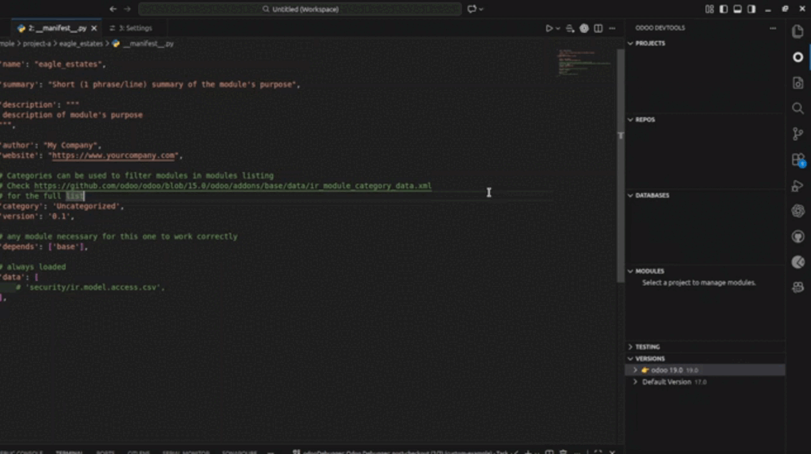
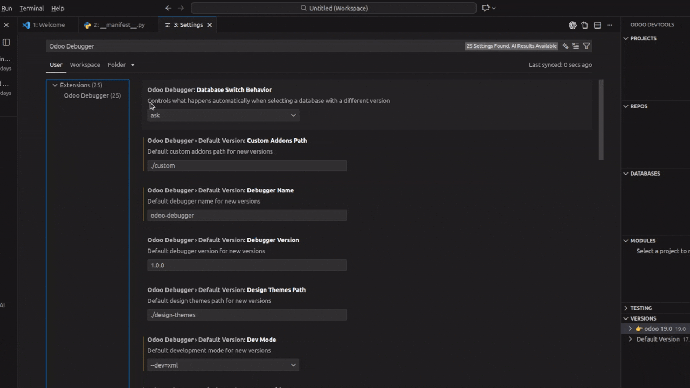
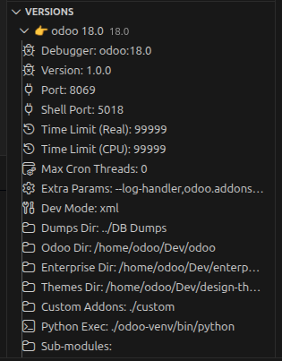
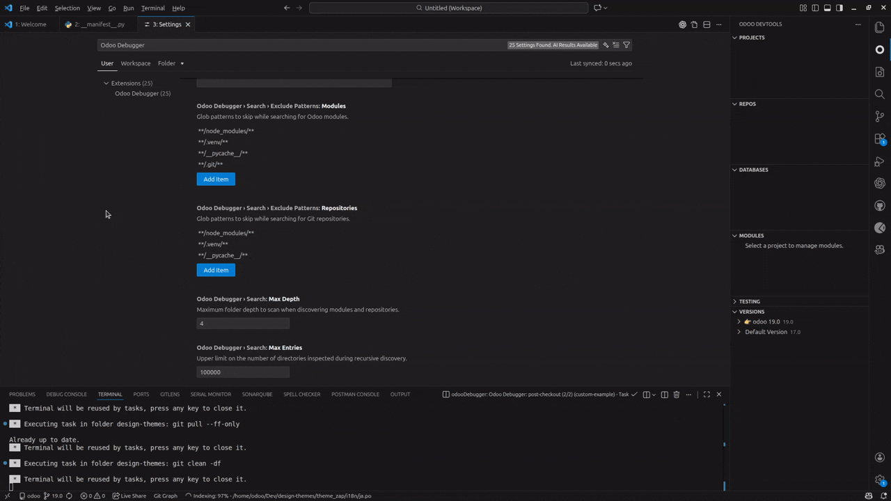
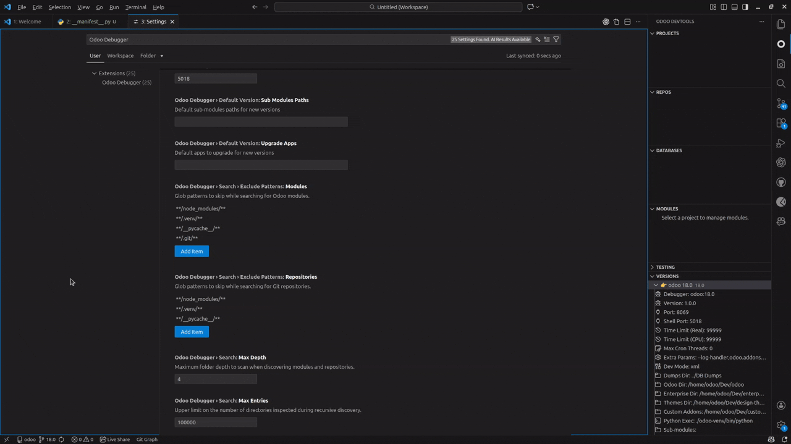
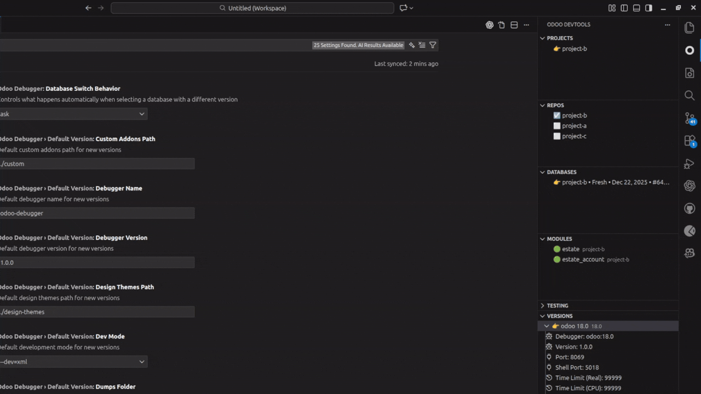
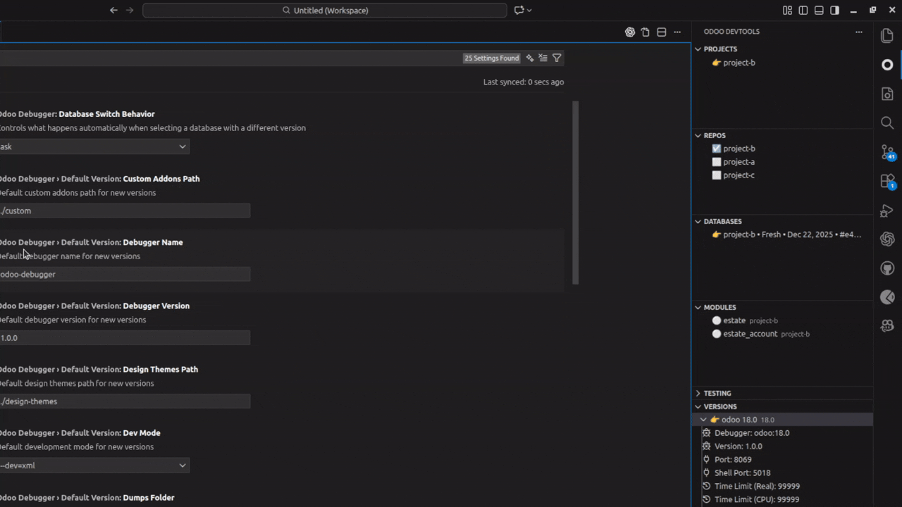
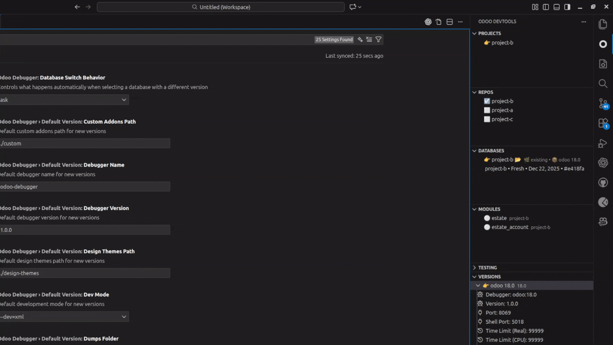

# Odoo DevTools for VS Code

All-in-one VS Code extension for managing and debugging Odoo projects: projects, repositories, databases, modules, version/branch switching, and quick server/shell launch.

## Setup

1. Open a folder in VS Code.
   This extension stores its state in `.vscode/odoo-debugger-data.json`, so projects/versions/databases are **workspace-specific**.

2. **(Optional, skip this step if Odoo is already set up. Running this again might overwrite or corrupt your setup)** Run `Project Selector: Setup Odoo`.
   This will:

   - Clone `odoo` and `enterprise` for a chosen branch
   - Create a Python virtual environment (e.g. `./venv`)

   

3. Configure defaults and other settings in VS Code settings under `odooDebugger.*`.
   Configurations include:

   1. New Versions' default values (`odooDebugger.defaultVersion.*`)
      Recommended to set early:

      - `odooDebugger.defaultVersion.odooPath`, `enterprisePath`, `designThemesPath`, `customAddonsPath`
      - `odooDebugger.defaultVersion.pythonPath`
      - `odooDebugger.defaultVersion.dumpsFolder`
   2. Database switch behavior (`odooDebugger.databaseSwitchBehavior`)
      Controls what happens when you select a DB that is linked to a different version/branch.
   3. Pre & Post auto-checkout commands

      - `odooDebugger.defaultVersion.preCheckoutCommands`
      - `odooDebugger.defaultVersion.postCheckoutCommands`
        These run **per "odoo" repository** during a branch switch, with the repo folder as the working directory.
   4. File search configurations (`odooDebugger.search.*`)
      Tune discovery speed/accuracy for large workspaces (depth, max entries, exclude patterns).

    

4. In the **Versions** view: create/activate a version (settings profile) and optionally switch branches.
   A version can be linked to each database and is used for:

   - Choosing the target Git branch for auto-checkout (when enabled)
   - Defining runtime settings used by `Odoo: Start Server` / `Odoo: Start Shell`

   Default version settings come from `odooDebugger.defaultVersion.*`, and you can edit settings directly from the Versions view after creation.

   

   Configurations include:
   - Debugger: VS Code debugger settings `debuggerName`/`debuggerVersion`
   - Server/Shell port numbers: `portNumber` / `shellPortNumber`
   - Other server settings: `extraParams` / `devMode` / `limitTime*` / `maxCronThreads` / etc.
   - Paths:
        1. Odoo/Enterprise/Design Themes Dir: Respective repo locations
        2. Custom Addons: Folder that contains the custom repos. **IMPORTANT: The extension detects git repositories only.**
        3. Python Exec: For python venv
        4. Dumps Dir: Folder that contains DB dumps
   It is recommended that all of these paths are configured as absolute files rather than relative
   - Extra Params: Used to add extra parameters to the runtime settings. To add extra params, add the `option` and `value` as comma-separated values. Example: `--log-handler,odoo.addons.base.models.ir_attachment:WARNING,--shell-interface,ptpython`

    

5. In the **Projects** view: create a project and select it.=

   - `Project Selector: Create Project` will guide you through project creation.
   - Selecting a project makes it the active context for the other views.

    

6. (Optional) In the **Repos** view: select the repos that belong to the project.

   - Already done in the project creation step
   - Repos are used for module discovery and are shown in the Project Repos views.
   - Include your `custom-addons` repos (and any internal repos you want scanned).

    

7. (Optional) In the **Databases** view: create a database (fresh or from dump) and select it.

   - Already done in the project creation step
   - A project can have multiple different databases
   - Choose **Fresh** for a clean DB (optionally install selected modules).
   - Choose **From Dump** to restore from a `dump.sql` folder or a `.zip` dump archive.
   - If the DB is linked to a version, selecting it may also switch version/branch depending on `odooDebugger.databaseSwitchBehavior`.'

    

8. (Optional) In the **Modules** view: select and apply module actions.

   - Select modules and mark them for **Install** or **Upgrade**.
   - Use the view actions to apply your selections to the selected database.

    

9. Use `Odoo: Start Server` / `Odoo: Start Shell`.

   - Open the Command Palette and run `Odoo: Start Server` to launch Odoo with the active version + selected DB.
   - Run `Odoo: Start Shell` for an interactive Odoo shell against the selected DB.

## Discord Chanel

For bug reports or feature requests, please join our discord channel: https://discord.gg/5DMzx3nr9z

## Features

### Projects + Repos

- Create/select projects and associate Git repositories with each project.
- Use the Project Repos views to browse only the repositories of the active project.

### Versions (Settings Profiles) + Branch Switching

- Create multiple versions (settings profiles) and set one as active.
- Each version has a target Odoo branch and runtime settings (paths/ports/params).
- When selecting a database linked to a different version/branch, the extension can auto-switch based on `odooDebugger.databaseSwitchBehavior`.

### Databases (Fresh / Dump / Existing)

- Create fresh databases, restore from dumps (folder or `.zip` archive), or connect to an existing DB.
- Databases can be linked to a version so selecting the DB can also activate the correct settings/branch.

### Modules (Install / Upgrade Workflows)

- Discover modules from the selected repositories.
- Mark modules for install/upgrade and apply the actions to the selected database.

### Checkout Hooks (Pre/Post Commands)

- Configure commands that run before/after branch switching (e.g., `pip install`, `npm install`, sanity checks).
- Commands run per repo during checkout and are executed via VS Code Tasks/Terminal.

## Core Concepts

- **Project**: a workspace grouping (repositories + databases).
- **Version**: a named settings profile (paths/ports/params) plus a target Git branch; one version is “active” at a time.
- **Database**: a PostgreSQL DB that can be linked to a version; selecting a DB may also switch the active version and/or Git branches.

## Views

This extension contributes views in the Activity Bar and Explorer:

- Activity Bar: Projects, Repos, Databases, Modules, Testing, Versions, Project Repos
- Explorer: Project Repos (file-tree view)

### Projects

- Create/select/delete/duplicate projects.
- Import/export projects for backup/sharing.
- Project selection drives what you see in Repos/Databases/Modules/Project Repos.

### Repos

- Select which Git repositories belong to the active project.
- Repos are used for module discovery and for the Project Repos views.

### Databases

- Create databases (fresh, from dump, or connect to existing).
- Restore DBs from a dump source (folder or `.zip`).
- If a DB is linked to a version, selecting it can switch behavior based on `odooDebugger.databaseSwitchBehavior`:
  - `ask`
  - `auto-both`
  - `auto-version-only`
  - `auto-branch-only`

### Modules

- Discovers modules from selected repos.
- Mark modules for install/upgrade and apply to the selected DB.
- Use PSAE/internal helpers when your repo layout requires it.

### Versions

- Create/clone/delete versions.
- Activate a version to apply its runtime settings (ports/paths/params).
- Change the version’s branch and optionally switch repos to that branch.
- Reset settings to defaults or save current settings as the new defaults.

### Project Repos (Activity Bar + Explorer)

- Browse the active project’s repositories and files.
- Useful as a project-scoped file view separate from the standard Explorer.
- Context actions include reveal, open terminal, rename/delete, copy/cut/paste.

## Configuration

Project data is stored in `.vscode/odoo-debugger-data.json` inside your workspace.

### Recommended Settings

At minimum, set the default paths for new versions (workspace-relative or absolute):

```jsonc
{
  "odooDebugger.defaultVersion.odooPath": "./odoo",
  "odooDebugger.defaultVersion.enterprisePath": "./enterprise",
  "odooDebugger.defaultVersion.designThemesPath": "./design-themes",
  "odooDebugger.defaultVersion.customAddonsPath": "./custom-addons",
  "odooDebugger.defaultVersion.pythonPath": "./venv/bin/python",
  "odooDebugger.defaultVersion.dumpsFolder": "./dumps"
}
```

### Settings Reference

Common VS Code settings include:

- `odooDebugger.defaultVersion.*` – defaults used when creating new versions (paths, ports, etc.)
- `odooDebugger.databaseSwitchBehavior` – how to handle version/branch mismatches when selecting a database
- `odooDebugger.search.*` – recursive discovery tuning
- `odooDebugger.defaultVersion.preCheckoutCommands` / `odooDebugger.defaultVersion.postCheckoutCommands` – shell commands run around branch checkouts

### Branch Checkout Hooks

Configure terminal commands to run before/after switching branches:

- `odooDebugger.defaultVersion.preCheckoutCommands`
- `odooDebugger.defaultVersion.postCheckoutCommands`

Commands run **once per repo being switched**, with the repo folder as the working directory, and are shown via VS Code Tasks/Terminal output.

Example:

```jsonc
{
  "odooDebugger.defaultVersion.preCheckoutCommands": [
    "git status --porcelain",
    "python -m compileall -q ."
  ],
  "odooDebugger.defaultVersion.postCheckoutCommands": [
    "pip install -r requirements.txt"
  ]
}
```

## Requirements (Runtime)

- VS Code
- Python + an Odoo environment (virtualenv recommended)
- PostgreSQL (and tools like `createdb`, `dropdb`, `pg_dump` if you use DB features)
- Git repositories for Odoo / addons (for branch switching)

## Tips & Troubleshooting

- If branch switching does nothing, confirm `odooDebugger.defaultVersion.odooPath/enterprisePath/designThemesPath` point to valid Git repos.
- If database operations fail, ensure your Postgres tools are installed and available in `PATH` (`createdb`, `dropdb`, `pg_dump`, etc.).
- If module discovery is slow in large workspaces, tune `odooDebugger.search.*` exclude patterns and max depth.
- If you changed VS Code settings but don’t see an effect, reload the window (`Developer: Reload Window`) and retry the action.

## License and Ethical Use Disclaimer

This project is provided under the AGPL-3.0 license. The license terms apply as written in `LICENSE`.

Separately, the maintainers request that you do not use this software for any unethical purposes, including any purpose that is haram (forbidden) under Islamic law, including but not limited to:

- Promoting, enabling, or facilitating riba (usury or interest-based transactions).
- Producing, distributing, or marketing alcoholic beverages, pork products, or gambling.
- Producing, distributing, or facilitating pornographic or sexually explicit material.
- Participating in or aiding fraud, deception, oppression, or harm to innocents.
- Engaging in activities involving spying, invasion of privacy, or breach of trust.
- Using the Software to support systems contrary to the moral or legal rulings of the four Sunni schools.

This section is a moral/ethical statement from the maintainers and is not intended to replace or modify the terms of the AGPL-3.0 license.
