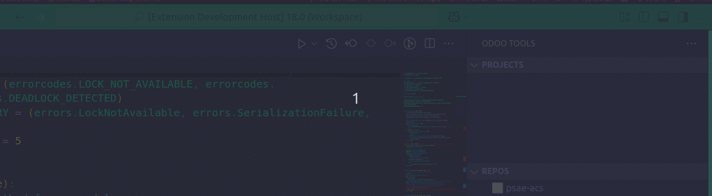
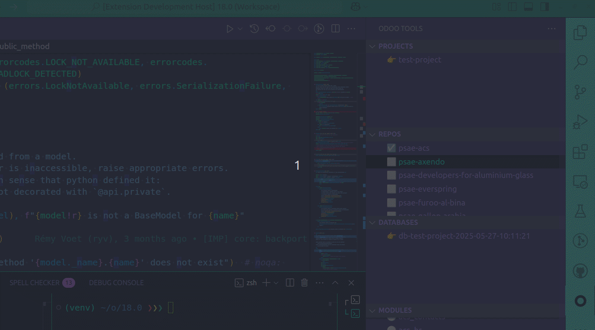
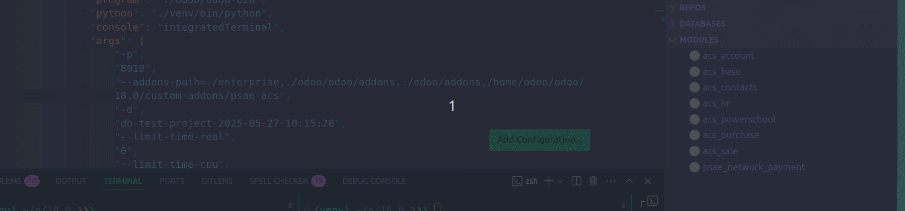
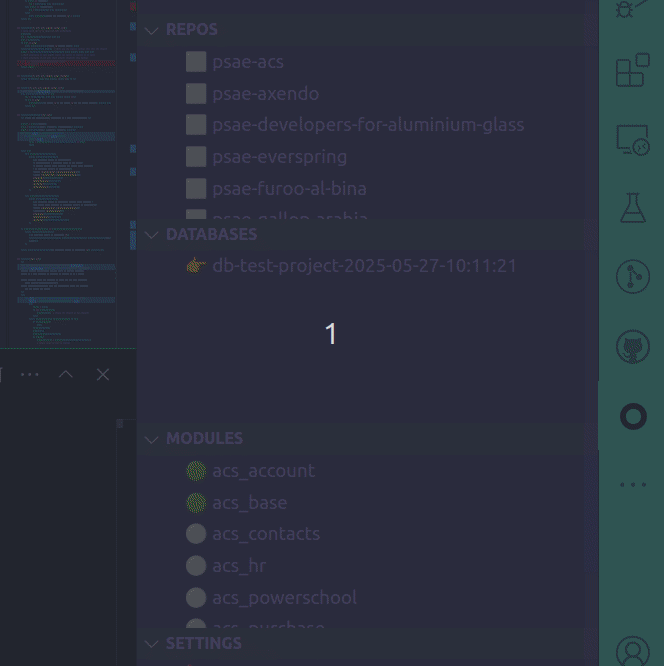
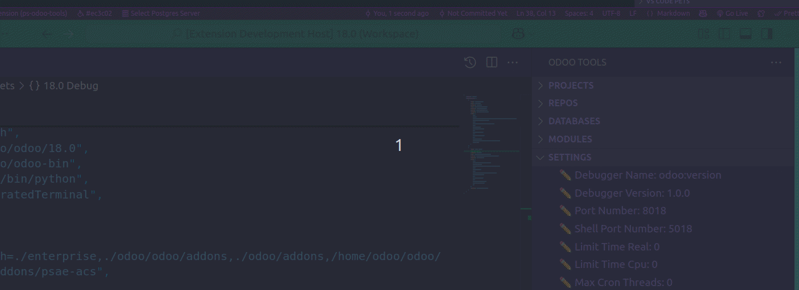
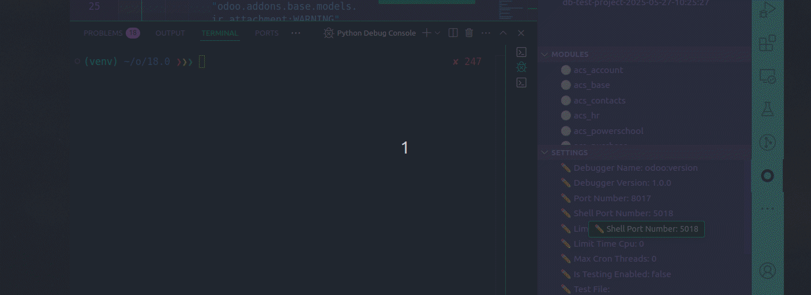

# 🐘 Odoo Debugger for VSCode

A powerful VS Code extension designed to help you **manage and debug Odoo projects** efficiently. This tool gives you an interactive and intuitive way to organize Odoo workspaces, projects, custom modules, databases, and debug configurations—all within VSCode.

---

## ✨ Features

### 🚀 Project Management
- **Create and Manage Projects** with custom addons and associated databases.
- Auto-detect and list **repositories** under your custom addons folder.
- One-click **select, delete, and switch projects**.
### 🎥 Demo

### 🗃️ Database Management
- Create, restore, and delete **Odoo PostgreSQL databases** tied to a project.
- Automatically attach database dumps and associate with repositories.
- Switch between project databases directly from the sidebar.

### 🧩 Module Selector
- Easily select and highlight custom Odoo modules.
- Quick integration with debugger setup.

### 📂 Repository Explorer
- List repositories per project.
- Select the primary repo to debug from.

### ⚙️ Workspace Settings
- Configure:
  - Odoo binary path
  - Python interpreter path
  - Addons path
  - Dumps folder
- Quickly edit settings from the UI.

### 🐞 Integrated Debugging
- One-click **Start Odoo Shell** inside the VS Code terminal.
- One-click **Start Odoo Server** using current project settings.
- Auto-refresh debugger when selecting a project, repo, database, or module.

---

## 🖼️ Extension Views

This extension adds the following views to the **Activity Bar**:

- 🔹 `Project Selector`  
- 🔹 `Repository Selector`  
- 🔹 `Database Selector`  
- 🔹 `Module Selector`  
- 🔹 `Workspace Settings`

Each view comes with context menu actions and buttons for creation, selection, and management.

---

## 🛠️ Requirements

- Node.js
- Python (typically ≥ 3.8)
- PostgreSQL with access rights
- Odoo compatible projects
- `odoo-bin` available in your workspace
- `pg_dump` and `createdb` available in PATH for database management

---

## 🧪 Commands

The extension registers the following VSCode commands:

| Command | Description |
|--------|-------------|
| `projectSelector.create` | Create a new project with optional database |
| `projectSelector.selectProject` | Switch active project |
| `projectSelector.delete` | Delete a project |
| `repoSelector.selectRepo` | Select repository for debugging |
| `dbSelector.create` | Create a new database |
| `dbSelector.selectDb` | Switch database |
| `dbSelector.delete` | Delete a database |
| `dbSelector.restore` | Restore database from dump |
| `moduleSelector.select` | Select a custom module |
| `workspaceSettings.editSetting` | Edit workspace settings |
| `workspaceSettings.startShell` | Launch Odoo shell in terminal |
| `workspaceSettings.startServer` | Start Odoo server in terminal |

---

## 📁 Configuration

All settings and metadata are stored in:

New Features to be added
- Get dumps from sh
- Scaffolder
- have short cuts to select modules and repositories
- odoo ubuntu installer
- extend the db
- when changing conf restart the server
- odoo tips and tricks readme

Known Issues
- Duplicate project names cause issues
