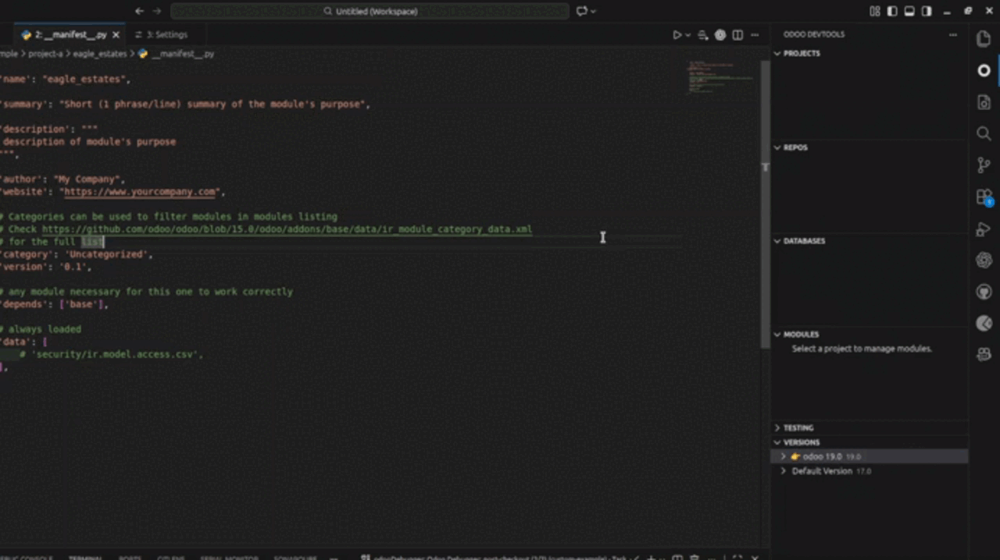
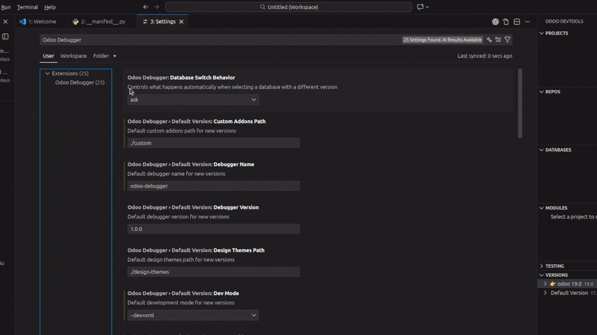
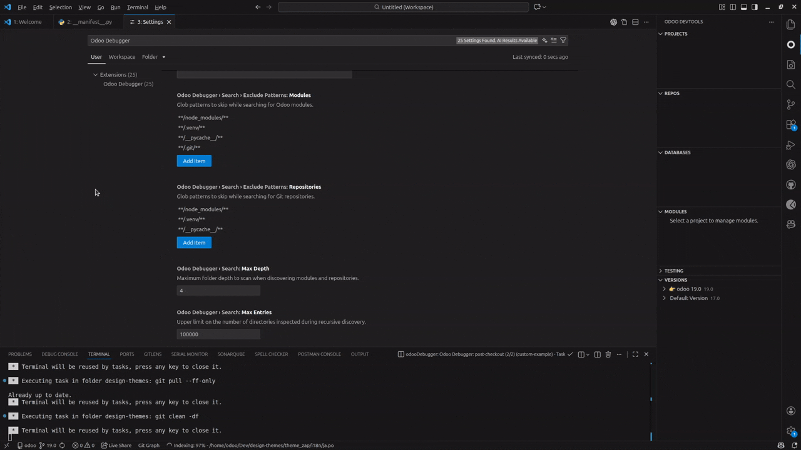
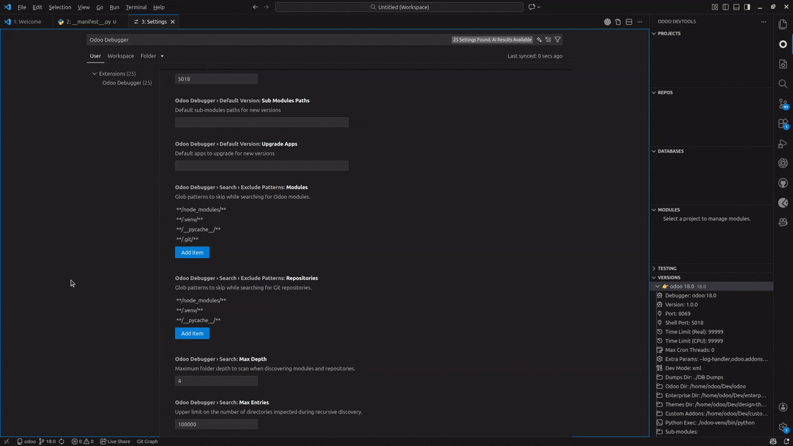
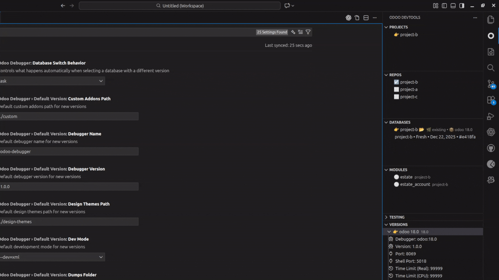

# Odoo DevTools for VS Code

All-in-one VS Code extension for Odoo development: projects, repositories, databases (create/restore/clone/templates), modules, version & branch switching, testing mode, and one-keystroke server/shell launch under the debugger.

A **Get Started with Odoo DevTools** walkthrough is available from VS Code's Welcome page after installing.

## Requirements

- Python + an Odoo environment (virtualenv recommended), with `debugpy` available for debugging
- PostgreSQL client tools in `PATH` (`psql`, `createdb`, `dropdb`) for the database features
- Git checkouts of Odoo / your addons (for branch switching)
- `unzip` / `gunzip` for restoring `.zip` / `.sql.gz` dumps

## Quick Start

**First run: `Odoo DevTools: Set Up`.** It asks for two things — the Odoo git repository to cut per-version worktrees from, and where to build environments (`~/odoo-dev` by default) — and it finds them for you where it can, so it is usually one confirmation. Both are stored at user level, so every workspace you open afterwards is already set up; a workspace that needs a different fork can override them. If you have no Odoo checkout yet, setup offers to clone one and records where it put it.

The source repository is never run directly: every version gets its own worktree cut from it, so that checkout stays yours to switch branches freely.

1. Open a folder in VS Code.
   The extension stores its state in `.vscode/odoo-debugger-data.json`, so projects/versions/databases are **workspace-specific**.

2. Run **`Odoo DevTools: Set Up`** — once per machine, not per workspace.
   It looks for Odoo checkouts you already have and shows what it found for confirmation, so this is usually one click. If there is nothing to find it offers to clone the repositories (community/enterprise/design-themes, any branch, optionally a **shallow copy**) and records where it put them.

   

3. Configure defaults under `odooDebugger.defaultVersion.*` in VS Code settings — most importantly the paths:

   ```jsonc
   {
     "odooDebugger.defaultVersion.odooPath": "./odoo",
     "odooDebugger.defaultVersion.enterprisePath": "./enterprise",
     "odooDebugger.defaultVersion.designThemesPath": "./design-themes",
     "odooDebugger.defaultVersion.customAddonsPath": "./custom-addons",
     "odooDebugger.defaultVersion.pythonPath": "./venv/bin/python",
     "odooDebugger.defaultVersion.dumpsFolder": "./dumps"
   }
   ```

   Absolute paths are recommended.

   

4. In the **Versions** view: create a version (branch pick + name — settings come from the defaults) and activate it.

   

5. In the **Projects** view: create a project. The wizard covers repositories and the first database.

   

6. In the **Modules** view: mark modules for **Install** or **Upgrade**.

   

7. Launch: `Odoo DevTools: Start Server` (`Ctrl+Alt+O S`) or `Start Shell` from the Projects view / Command Palette.

## Core Concepts

- **Project**: a grouping of repositories + databases (+ tickets and a testing configuration).
- **Version**: a named settings profile (paths/ports/params) bound to a target git branch; one version is *active* at a time.
- **Database**: a PostgreSQL DB that carries its full environment — a linked version profile and per-repo branch assignments. Selecting a database aligns your workspace to it.

## Database-Driven Switching

Selecting a database aligns the active version, the core repo branches (odoo/enterprise/design-themes) and the project repo branches to what that database expects, controlled by `odooDebugger.databaseSwitchBehavior`:

- `auto` (default): align silently
- `ask`: one notification with **Switch** / **Keep Current**
- `never`: selection only, no switching

The status bar shows the active project, database and version — click any of them to switch.

## Views

Activity Bar (**Odoo DevTools**): Projects, Repos, Databases, Modules, Testing, Versions.
Explorer sidebar: **Project Repos** (project-scoped file tree).

### Projects

- Create/select/delete/duplicate projects; import/export them as JSON for backup or sharing.
- Project selection drives every other view.
- **Tickets**: attach ticket/task ids to a project and open them with `odooDebugger.ticketBaseUrl`. `Detect Tickets from Branches & Manifests` scans your repo branch names and module manifests for task ids automatically.
- **Workspace**: build/open a multi-root `.code-workspace` from the project's repos (`Open Project Workspace`, `Quick Switch Project Workspace`).

### Repos

- Choose which addons sources (discovered under your custom addons folder) belong to the active project: **git repositories and plain folders containing Odoo modules** — a folder full of modules is picked up even before `git init`.
- Git repos show their current branch; git-less folders are marked *addons folder*. Sort by name, creation date or branch.
- Right-click a repo to reveal it in the Explorer or OS, copy its path, or open it in a terminal.

### Databases

- Create databases four ways: **Fresh**, **From Dump** (folder with `dump.sql`, `.zip`, `.sql`, `.sql.gz` — streamed straight into psql), **From Template** (`createdb -T` clone), or **Connect to Existing** (picked from your live PostgreSQL instance).
- Restored dumps are neutralized for development: crons and outgoing mail disabled, passwords reset (`admin`/`admin`), fresh database UUID, extended expiration, mailcatcher entry.
- The Odoo version is **auto-detected** from the database contents and linked to the matching version profile.
- Context actions: **rename display name**, copy name, clone, restore, **open in browser**, **open psql shell**, change linked version, configure per-repo branches, delete. Renaming only changes the label — the PostgreSQL database keeps its name.
- **Templates** (`Manage Database Templates`): register or create template databases and clone from them in seconds; import/export template lists as JSON.
- **Creating a database asks which branch each project repo should use** — before anything is created or restored, so cancelling costs nothing. *Use current branches* is one of the answers; it is no longer an assumption. Cloning a database inherits its source's mapping.
- **Running databases are marked** in the list: `running :8017` for a server this extension started, `running (external)` for one started from a terminal or another window. Each version also remembers the database it last launched, so switching versions restores the right `-d`.
- **Reconcile Databases** finds stored references whose PostgreSQL database no longer exists and removes them in one pass.

### Modules

- Modules discovered from the project's repos; click to cycle install → upgrade → unmanaged. State reads by icon shape (down-arrow = install, up-arrow = upgrade, filled circle = installed, outline = not installed), so it stays legible even when a row is highlighted.
- **Multi-select** (Ctrl/Shift-click) to set install/upgrade/clear on several modules at once.
- **Configure Modules** (`Ctrl+Alt+O M`): a quick pick over all modules — Enter cycles install → upgrade → unmanaged, and per-item buttons set a state directly; stays open for several changes.
- Right-click a module to **Reveal in Explorer** (VS Code file tree) or **Reveal in OS**.
- Expand a module to see its manifest dependencies (project modules vs core).
- Bulk actions: install all, update all, update installed, clear; browse the modules actually installed in the database.
- **Create Module** scaffolds a new module via `odoo-bin scaffold` into a chosen repo.
- `ps*-internal` directories appear as collapsible groups with an include/exclude toggle for the addons path.

### Testing

- Toggle testing mode (module selections are stashed and restored when you leave it).
- Configure test targets (tags, modules, classes, methods — click to cycle include/exclude/disabled), a test file, `--stop-after-init` and a log level.
- The view shows the exact test flags added to the launch configuration.

### Versions

- **Create a version and its environment in one step.** Pick a branch, confirm the name, and the extension provisions a git **worktree** for that branch, picks a Python interpreter the branch actually supports, builds a **virtualenv** and installs `requirements.txt` — with live progress and cancellation. Choose *Profile only* to create the version without building anything.
- Because each version owns its worktree, **several versions can be checked out at once** — useful for comparing a database before and after an upgrade — and activating a version no longer checks anything out, so it can't fail on a dirty working tree.
- Your configured `odooPath` is used **only as a source** to cut worktrees from; a version never runs out of it, even when it happens to be on the matching branch. That directory stays yours to switch freely. Each worktree gets its own `odt/<branch>` branch tracking `origin/<branch>`, so `git pull` works inside it.
- The required Python version is read from the branch itself (`setup.py`'s `python_requires` or `odoo/release.py`'s `MIN_PY_VERSION`, plus the distributions named in `requirements.txt`'s header), so 17.0 gets 3.10 and 19.0 gets 3.12 without any hand-maintained table. An interpreter already installed via pyenv or your system is reused when it fits; otherwise [uv](https://docs.astral.sh/uv/) installs the right one.
- After provisioning, a **dependency check** reports what's missing (`wkhtmltopdf`, PostgreSQL client tools, `rtlcss`, and the build headers `lxml`/`psycopg2`/`ldap` need) with a copy-paste install command for your platform. Nothing is installed for you and nothing runs `sudo`.
- Each version's **debugger name, HTTP port and shell port are derived from its branch** — `odoo:17.0` on ports 8017/5017, `odoo:18.0` on 8018/5018 — and shown in the tree as read-only rows. That is what lets two versions run at the same time, which is the point when you are comparing a database before and after an upgrade. `odooDebugger.debuggerNamePrefix` changes the `odoo` part; the ports follow the series and step upward if another version, or any other process, has already claimed one.
- **Check Version Environments** (Versions view title bar) reports any version whose directories are missing, unprovisioned or sitting outside the current environments folder, and re-provisions the ones that need it. Versions pointing at directories that no longer exist are flagged once on activation.
- Each version row shows whether it is provisioned. Deleting a version offers to remove the folders the extension created — and never the ones you made yourself.
- Clone, delete, activate; edit any setting inline from the tree.
- Reset settings to the configured defaults, or save a version's settings as the new defaults.

### One copy per branch (upgrades)

During an upgrade you need two versions running against **their own** custom
code. Right-click a repository in Project Repos and choose **Use One Copy Per
Branch**: each branch that repository is mapped to gets its own working
directory under your environments folder, so 17.0 and 19.0 stop competing for
one checkout.

This is opt-in per repository, and off by default — ordinary development, where
a feature branch simply follows staging and prod, does not need it.

The confirmation names the exact directories that will be created, because that
is where you will edit that branch's code from then on. Your original checkout
becomes a **source**: never in the addons path, never run, and yours to switch
freely without changing what any version runs. Commits and pushes from a
worktree go to the real branch — it is the same repository, one object store,
so nothing needs syncing back.

Because git can only check a branch out in one place, the source checkout has
to let go of a branch a worktree needs. You are asked, never surprised: moving
it to another branch is offered first (it keeps working normally), detaching is
the alternative, and a checkout with uncommitted changes is refused with its
changed files named.

Two safeguards keep you out of the wrong copy: the repo views, Modules view and
generated workspace show only the active version's copies, and opening a file
belonging to another version offers to reopen the same file in the active one.

Turning the mode back off removes the worktrees the extension created, keeping
any with uncommitted changes and telling you which.

### Project Repos (Explorer)

- Browse only the active project's repositories, with the current branch shown per repo.
- Right-click actions: reveal in Explorer/OS, copy path, open in terminal, new file/folder, rename. Destructive operations (delete, cut/paste) are intentionally left to the built-in Explorer.
- Repos whose folder was moved or deleted are flagged with a **Relocate Repository** action.
- Honors your `files.exclude` settings.

## Debugging & launch.json

The extension maintains **one launch configuration per provisioned version** in `.vscode/launch.json`, each named after that version's derived `debuggerName` and carrying its own port and database. Only those entries are rewritten — your own configurations and comments are preserved. It assembles `--addons-path`, `-d`, `-i`/`-u` from your module selections, ports, time limits, dev mode and testing flags automatically.

Because the entries are stable and unique, the Run and Debug dropdown works as a version switcher. **F5 follows whatever the dropdown has selected, while `Ctrl+Alt+O S` always follows the *active* version.** That divergence is deliberate: it is what lets you debug one version from the dropdown while launching another from the chord. **Stop Server** targets the active version's session, and asks only when several versions are running and none of them is the active one.

Generated project workspaces also include the active version's own `odoo`, `enterprise` and `design-themes` checkouts, so files you open belong to the version you are running and breakpoints bind to the right worktree.

Server commands: **Start Server**, **Run Server Without Debugging**, **Restart Server**, **Stop Server**, **Open Odoo in Browser** (uses the active version's port and the selected database), and **Copy Odoo Command** — copies the exact `python odoo-bin …` command line the debugger runs (assembled from the selected project, active version and database) to the clipboard, ready to paste into a terminal. With `odooDebugger.server.openBrowserOnStart` enabled, the browser opens automatically once the server port accepts connections.

## Editor Actions

Right-click inside a file that belongs to an Odoo module (toggle with `odooDebugger.editorActions.enabled`):

- **Run Odoo Tests for Current File** (on `test_*.py`) — enables testing mode, targets the file and its module, and starts the server.
- **Upgrade Current Module** — marks the module for `-u` and offers a server restart.
- **Reveal Module in Modules View** — highlights the module in the tree, including inside `ps*-internal` groups.

## Post-Switch Hooks

`postSwitchCommands` run **once per core repo** after a version's environment is aligned — whether or not a branch checkout was needed — with the repo folder as the working directory, logged in the `Odoo Debugger: Branch Hooks` output channel.

A version's own `postSwitchCommands` win; `odooDebugger.defaultVersion.postSwitchCommands` is the fallback for versions that define none.

```jsonc
{
  "odooDebugger.defaultVersion.postSwitchCommands": [
    "npm install"
  ]
}
```

Installing Python requirements no longer belongs here — provisioning owns that.

> Upgrading from 1.2: `postCheckoutCommands` is renamed automatically, in both your settings and your stored versions. **`preCheckoutCommands` is removed** — it guarded a checkout that was about to happen, and there is no longer one to guard; running it after the switch would discard uncommitted work rather than clear the way. A one-time notice names what was dropped so you can re-add anything that still makes sense as a post-switch command.

## Commands & Keybindings

| Keybinding | Command |
| --- | --- |
| **Server** | |
| `Ctrl+Alt+O S` | Start Server |
| `Ctrl+Alt+O X` | Stop Server |
| `Ctrl+Alt+O N` | Run Server Without Debugging |
| `Ctrl+Alt+O R` | Restart Server |
| `Ctrl+Alt+O H` | Start Odoo Shell |
| `Ctrl+Alt+O B` | Open Odoo in Browser |
| **Switch** | |
| `Ctrl+Alt+P` | Search Projects (quick switch) |
| `Ctrl+Alt+O D` | Search Databases (quick switch) |
| `Ctrl+Alt+O V` | Switch Active Version |
| `Ctrl+Alt+O W` | Open Project Workspace |
| **Create** | |
| `Ctrl+Alt+O C` | Create Project |
| `Ctrl+Alt+O Shift+D` | Create Database |
| `Ctrl+Alt+O Shift+M` | Create Module (scaffold) |
| `Ctrl+Alt+O Shift+V` | Create Version |
| **Work** | |
| `Ctrl+Alt+O M` | Configure Modules (quick pick) |
| `Ctrl+Alt+O U` | Upgrade Current Module |
| `Ctrl+Alt+O F` | Run Odoo Tests for Current File |
| `Ctrl+Alt+O T` | Toggle Testing Mode |
| `Ctrl+Alt+O L` | Manage (Link) Project Tickets |
| `Ctrl+Alt+O O` | Open Project Ticket |
| `Ctrl+Alt+O K` | Keyboard Shortcuts cheat sheet |

The scheme: plain letters act, `Shift` variants create the matching thing (`D` switches databases, `Shift+D` creates one). Forgot a chord? `Ctrl+Alt+O K` (or **Odoo DevTools: Keyboard Shortcuts** in the palette / the Projects view `…` menu) lists every shortcut — picking one runs its command.

Every view also has search (`$(search)`) and sort (`$(sort-precedence)`) actions in its title bar. All palette commands live under the **Odoo DevTools** category.

## Settings Reference

- `odooDebugger.defaultVersion.*` — defaults applied to newly created versions (paths, params, post-switch hooks). Existing versions are edited from the Versions view. Note that `debuggerName`, `portNumber` and `shellPortNumber` are **no longer** among these: they are derived from each version's branch.
- `odooDebugger.debuggerNamePrefix` — prefix for generated launch configuration names (`<prefix>:<branch>`, default `odoo`).
- `odooDebugger.sourceRepo.odoo` / `.enterprise` / `.designThemes` — the repositories per-version worktrees are cut from. Set once by **Set Up**, at user level.
- `odooDebugger.provisioning.root` — directory holding per-version worktrees and virtualenvs. Empty means `~/odoo-dev`.
- `odooDebugger.provisioning.uvPath` — path to an existing `uv` binary. Empty means look on `PATH`; when uv is absent, provisioning falls back to the standard library `venv` and `pip`.
- `odooDebugger.databaseSwitchBehavior` — `auto` / `ask` / `never` (see above).
- `odooDebugger.statusBar.enabled` — show the project/database/version status bar items.
- `odooDebugger.server.openBrowserOnStart` — open the web client automatically after the server starts (default off).
- `odooDebugger.editorActions.enabled` — show the Odoo actions in the editor right-click menu (default on).
- `odooDebugger.ticketBaseUrl` — base URL used by Open Project Ticket.
- `odooDebugger.search.*` — module/repository discovery tuning (max depth, max entries, exclude patterns) for large workspaces.

Diagnostics are written to the **Odoo DevTools** output channel (View → Output).

## Tips & Troubleshooting

- If branch switching does nothing, confirm the version's `odooPath`/`enterprisePath`/`designThemesPath` point to valid git repos.
- If database operations fail, ensure the PostgreSQL client tools are installed and in `PATH` (`psql`, `createdb`, `dropdb`).
- If module discovery is slow in large workspaces, tune the `odooDebugger.search.*` exclude patterns and max depth.
- If a repo shows **path missing** in Project Repos, use *Relocate Repository* to point it at the moved folder.
- Check the **Odoo DevTools** output channel for logged errors before filing an issue.

## Support

For bug reports or feature requests, join the Discord channel: https://discord.gg/5DMzx3nr9z

## License and Ethical Use Disclaimer

This project is provided under the AGPL-3.0 license. The license terms apply as written in `LICENSE`.

Separately, the maintainers request that you do not use this software for any unethical purposes, including any purpose that is haram (forbidden) under Islamic law, including but not limited to:

- Promoting, enabling, or facilitating riba (usury or interest-based transactions).
- Producing, distributing, or marketing alcoholic beverages, pork products, or gambling.
- Producing, distributing, or facilitating pornographic or sexually explicit material.
- Participating in or aiding fraud, deception, oppression, or harm to innocents.
- Engaging in activities involving spying, invasion of privacy, or breach of trust.
- Using the Software to support systems contrary to the moral or legal rulings of the four Sunni schools.

This section is a moral/ethical statement from the maintainers and is not intended to replace or modify the terms of the AGPL-3.0 license.
